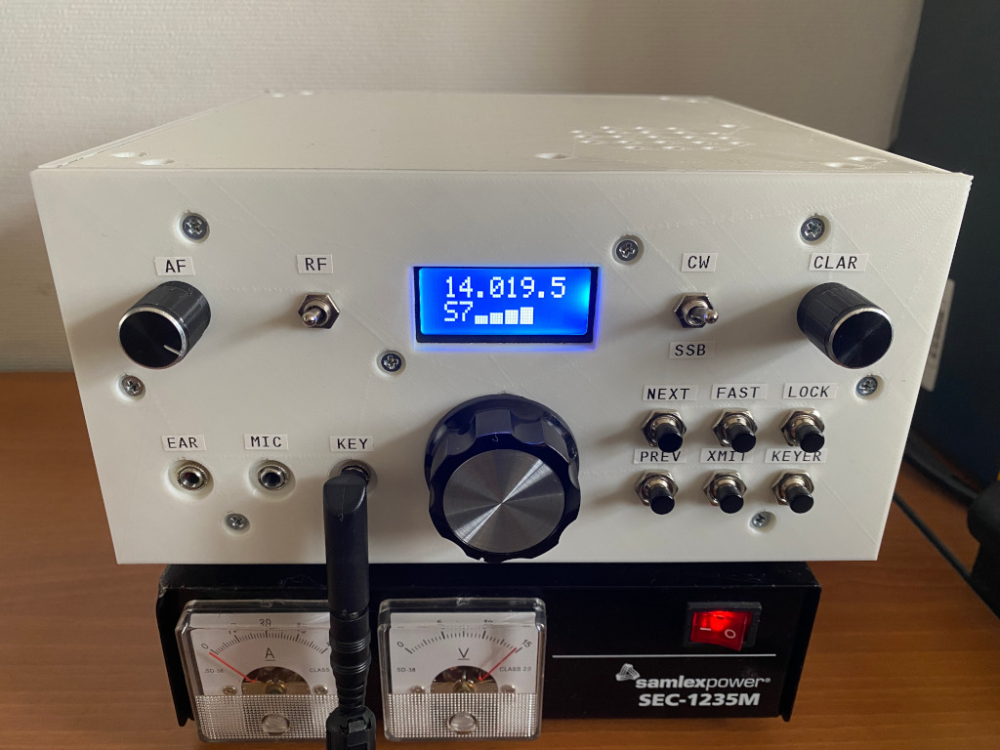

# HBR/MK2

All HF bands QRP CW/SSB transceiver "HomeBrew Radio, Mark 2".

* Covers 80, 40, 30, 20, 17, 15, 12 and 10 meters
* Classical single IF superheterodyne design
* Effective IF derived AGC
* Voice compression
* Supports RIT and XIT
* 10-30 WPM Elekey-B type keyer + straight key mode
* Keyer supports record and playback, programmable with paddles
* Five favorite frequencies per band (press NEXT/PREV in FAST mode)
* Class AB amplifier provides ~5W in SSB and 5-10W in CW
* Has a S-meter and a SWR meter
* Open-source firmware, schematic and 3D-printable enclosure

Links:

* Article (in Russian): https://eax.me/hbr-mk2-transceiver/
* Post on Hackaday: https://hackaday.com/2024/05/13/github-hosts-ham-radio/
* Discussion on AmateurRadioBuilders@groups.io: https://groups.io/g/AmateurRadioBuilders/topic/106073792
* Video blog on YouTube: https://www.youtube.com/playlist?list=PL6CWlCy5akj5v1Z4mPysYlqgNtCBYy-wM
* Demo: https://www.youtube.com/watch?v=D7rNUXjIyPM
